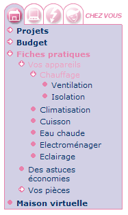
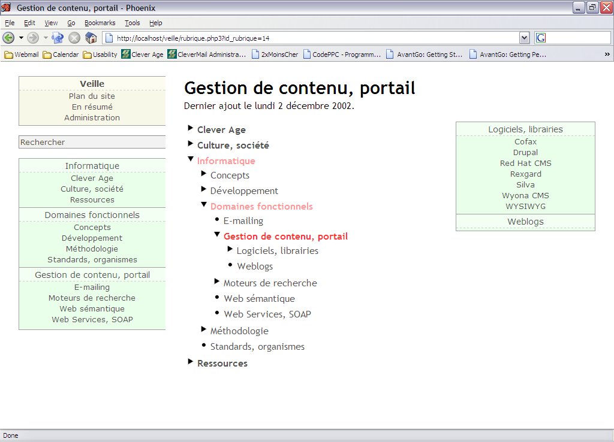

--- 
title:      "Une arborescence dynamique et contextuelle" 
lang:       fr 
tags:       [SPIP, Clever Age]
---

Voici comment obtenir très simplement dans tout site SPIP un menu arborescent dynamique du plus bel effet. Comble de bonheur, il sait en plus être contextuel pour s'adapter à la page où il est affiché, et il a la bonne idée de se servir des fonctionnalités DHTML déjà présentes dans SPIP.

*Article initialement publié sur [SPIP-Contrib](http://www.spip-contrib.net/article103.html).*

Voici donc comme promis depuis plus de six mois une version simplifiée et nettoyée du menu arborescent dynamique que nous ([Clever Age](http://www.clever-age.com/)) avons réalisée pour la partie du site EDF dédiée aux [particuliers](http://particuliers.edf.fr/).

Voilà un exemple très parlant de ce que l'on peut en faire :



Voyez par vous-même : <http://particuliers.edf.fr/rubrique25.html>

Et voilà ce que ça donne en installation de base :



# Utilisation

Il suffit de télécharger le fichier ci-dessous, de le *dézipper* à la racine de votre SPIP en s'assurant au préalable qu'il n'y a pas déjà 
un fichier `menu.html` et/ou un fichier `menu.php3`.

[menu.zip](menu.zip)

Ensuite, ajoutez par exemple dans le `rubrique.html`, à l'endroit où vous voulez voir le menu :

```
<INCLURE(menu.php3){id_rubrique}>
```

# Personnalisation

## Personnalisation des textes : couleurs, polices, tailles…

La personnalisation s'effectue via la feuille de style présente dans le squelette `menu.html` :

```css
<style>
.secteuroff { font-weight: bold; }
.rubriqueoff { font-weight: normal; }
.secteuron, .rubriqueon { font-weight: bold; color: #ff9999; }
.secteur, .rubrique { font-weight: bold; color: #ff3333; }
</style>
```

Une différentiation est faite entre les secteurs et les rubriques de niveaux inférieurs et entre ces mêmes éléments selon qu'ils font ou non partie de la hiérarchie de l'élément courant :


- `secteuroff` pour un secteur différent de celui de l'élément courant
- `secteuron` pour le secteur de l'élément courant
- `rubriqueoff` pour une rubrique n'appartenant pas à la hiérarchie de l'élément courant
- `rubriqueon` pour une rubrique appartenant à la hiérarchie de l'élément courant
- `secteur` pour un secteur si c'est l'élément courant
- `rubrique` pour la rubrique courante si ce n'est pas un secteur

Cette feuille de style peut éventuellement être retirée de ce squelette et replacée dans la feuille de style générale.

## Personnalisation des images

Comme vous pourrez le lire ci-dessous, ce menu exploite des fonctions déjà présentes dans SPIP, mais utilise une copie des images concernées.

Il est donc possible de remplacer les images de pliage et dépliage par d'autres, mais à condition de les remplacer par des images de mêmes noms et de même taille : 16 x 14 pixels.

De même, les puces peuvent aussi être remplacées.

# Pourquoi recopier le répertoire `img_pack/` ?

Comme vous pourrez le voir dans le zip, il est nécessaire de reprendre dans la racine une partie du répertoire `img_pack/` qui se trouve normalement dans `ecrire/`.

C'est tout simplement que ce menu exploite les fonctionnalités DHTML développées pour l'interface de publication de SPIP (ie ce qui se trouve dans `ecrire/inc_layer.php3`) plutôt que s'appuyer sur un script DHTML externe à la manière du [menu proposé par Kangourou](http://www.spip-contrib.net/article90.html).

Or, les fonctions utilisées génèrent du code HTML faisant référence de manière relative aux images contenues dans `img_pack`, ce qui oblige à en faire une copie à la racine. Heureusement, cela permet par ailleurs la personnalisation expliquée ci-dessus.

# Compatibilité

| Plateforme | Navigateur        | Fonctionne | Ne fonctionne pas |
|------------|-------------------|------------|-------------------|
| Windows    | Internet Explorer | 6.0        |                   |
| Windows    | Netscape          | 6.1, 7.02  | 4.51[^note]       |
| Windows    | Mozilla           | 1.0, 1.3   |                   |
| Windows    | Phoenix           | 0.5        |                   |
| Windows    | Opera             | .          | 6.05[^note]       |
| Windows    | Crazy Browser     | 1.05       |                   |

[^note]: Toujours déplié
