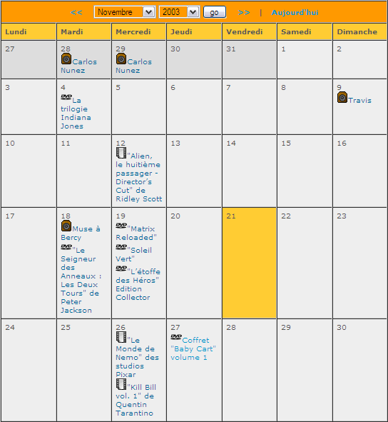
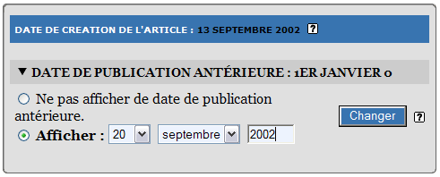
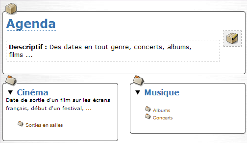
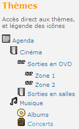

Il peut être tentant d'utiliser SPIP pour présenter un agenda d'événements sous forme de calendrier. Plutôt que devoir intégrer un logiciel externe spécialisé, et en attendant que SPIP intègre peut-être un jour un nouveau type de données dédié aux événements, voici un squelette mêlant boucles SPIP et code PHP.

ATTENTION, cette contrib ne semble plus fonctionner avec les versions de SPIP ultérieure à la 1.8.2, ce qui a mené à « [La fin de l'agenda Gastero Prod…](/2005/11/la-fin-de-l-agenda-gastero-prod.html) »

*Cet article présente une évolution de la méthode déjà présentée sur le site des contributions pour SPIP : [spip_contrib](http://www.uzine.net/spip_contrib/article.php3?id_article=113).*

{caption="Exemple d'agenda. L'agenda de [Gastero Prod](http://www.gasteroprod.com/agenda/)"}

## De quelles informations avons-nous besoin ?

La première étape consiste à déterminer comment les informations seront stockées dans SPIP, et donc saisies par les rédacteurs.

L'objectif principal étant qu'un rédacteur puisse définir une date à laquelle un événement donné doit avoir lieu, nous avons besoin des éléments suivants :

- Au moins un champ de type texte ;
- Un champ de type date.

Pour le champ texte, c'est simple, et nous allons même pouvoir nous régaler. SPIP nous en propose au moins 3 très utiles et systématiquement présents quel que soit le paramétrage du site :

- le titre,
- le descriptif
- et le texte.

## La date de publication antérieure ou la *vraie* date de publication ?

La date de publication d'un article est déterminée automatiquement lors de sa validation, ce qui signifie que l'auteur ne peut pas la préciser à l'avance. Elle peut en revanche être modifiée par les administrateurs une fois que l'article est validé, mais l'auteur initial n'y a plus accès s'il n'est pas lui-même administrateur.

Pour utiliser cette date, il est de plus nécessaire de configurer le site pour que SPIP publie les articles post-datés, ce qui peut être gênant par ailleurs.

Cette date n'est donc pas vraiment utile pour indiquer une date d'événement.

Heureusement, SPIP propose aussi une *date de publication antérieure*, normalement utilisée pour indiquer à quelle date a été publié un article repris ultérieurement dans SPIP, et qui peut être définie librement par le rédacteur[^t1].

C'est cette date que nous allons utiliser pour définir les événements de l'agenda.

{caption="Utilisation de la date de publication antérieure"}

## Organiser les événements

Si l'agenda doit contenir beaucoup d'informations de natures diverses, il peut s'avérer utile de les qualifier (concert, film, réunion, etc.) pour les mettre en évidence et éventuellement ensuite les afficher de manière sélective.

Dans SPIP deux méthodes de classement viennent immédiatement à l'esprit :

- classement par rubrique et sous-rubriques
- classement par mot-clé

Pour l'agenda, nous allons utiliser les rubriques, ce qui nous permettra de constituer toute une arborescence pour stocker les articles événements. Cela va nous permettre de filtrer les types d'événements avec une notion de granularité progressive grâce au critère `{branche}`[^t2].

{caption="Une hiérarchie de rubriques pour les thèmes"}


Dans l'[agenda de Gastero Prod](http://www.gasteroprod.com/agenda/), le rubriquage n'est pas très développé, mais il est déjà possible de sélectionner uniquement les [événements musicaux](http://www.gasteroprod.com/agenda/46.html), et éventuellement de filtrer encore plus en ne considérant que les [concerts](http://www.gasteroprod.com/agenda/44.html).

Notez au passage que les logos des rubriques sont utilisés pour illustrer les événements.

{caption="Le rendu de la sélection thématique"}


## Intégrer l'agenda dans la partie publique

Voilà, les événements sont créés dans une arborescence de rubriques thématiques et sont positionnés à une date, passons aux choses sérieuses, l'intégration de l'agenda résultant dans les pages du site.

Pour insérer l'agenda dans votre site, le plus simple est de créer un squelette particulier pour la rubrique de votre agenda.

J'ai par exemple créé le squelette [`agenda.html`](http://www.gasteroprod.com/design/agenda.html) sur Gastero Prod, et je l'utilise selon le principe classique de SPIP dans le script `agenda.php3`.

Revenons calmement sur les parties importantes de ce squelette…

Les paramètres de navigation d'un mois à l'autre sont passés dans l'URL au travers de la variable `date`[^t3].

Cela permet à l'agenda de ne récupérer directement en boucle SPIP que les événements du mois donné, alors que dans [la version précédente de l'agenda](http://www.uzine.net/spip_contrib/article.php3?id_article=113), la sélection se faisait en PHP après une sélection en SPIP de tous les événements. La différence est donc de taille au niveau des performances.

Il faut récupérer tous les événements qui d'une part ont lieu dans le mois courant de cette date, et qui d'autre part font partie de la sélection thématique.

Sachant que la date n'est utilisable que dans une boucle de premier niveau, et que le critère `{branche}` n'est utilisable que dans une boucle incluse dans une boucle `RUBRIQUE`, donc au moins de second niveau, il est malheureusement impossible de réaliser la sélection d'événement en SPIP pur.

Tout d'abord, on prépare quelques données qui seront utilisées par la suite :

```php
$months = array('', 'Janvier', 'Février', 'Mars', 'Avril', 'Mai', 'Juin', 'Juillet', 'Août', 'Septembre', 'Octobre', 'Novembre', 'Décembre');
$days = array('Dimanche', 'Lundi', 'Mardi', 'Mercredi', 'Jeudi', 'Vendredi', 'Samedi');

if (!isset($date) || $date == '') $date = date('Y-m-d');
ereg("^([0-9]{4})-([0-9]{2})-([0-9]{2}).*$", $date, $regs);
$cal_day = mktime(0, 0, 0, $regs[2], $regs[3], $regs[1]);

$D = date('d', $cal_day);
$M = date('m', $cal_day);
$Y = date('Y', $cal_day);
```

Ensuite, on rempli un tableau avec la liste des rubriques thématiques retenues :

```spip
$branche = array();
<BOUCLE_courante(RUBRIQUES){id_rubrique}>
    <BOUCLE_branche(RUBRIQUES){branche}>
        $branche[] = #ID_RUBRIQUE;
    </BOUCLE_branche>
</BOUCLE_courante>
```

Puis on récupère dans un nouveau tableau la liste des événements du mois donné[^t4] :

```spip
$events = array();
<BOUCLE_evts(ARTICLES){id_secteur=43}{age_relatif_redac > -38}{age_relatif_redac < 38}{par date_redac}>
    if (in_array(#ID_RUBRIQUE, $branche)) {
        $dateEvt = ereg_replace("^([0-9]{4})-([0-9]{2})-([0-9]{2}).*$", "\\1\\2\\3", '#DATE_REDAC');
        if (!isset($events[$dateEvt])) {
            $events[$dateEvt] = array();
        }
        $events[$dateEvt][] = array('rub' => #ID_RUBRIQUE, 'link' => '#URL_ARTICLE', 'title' => '[(#TITRE|texte_script)]', 'logo' => '');
    }
</BOUCLE_evts>
?>
```

Une fois que l'on a notre tableau rempli de dates et événements, il ne reste plus qu'à l'afficher.

Voici le code brut du tableau représentant l'agenda :

```spip
<table cellpadding="5" cellspacing="0" align="center" border="1" class="agenda">
<form name="navigation" method="get">
<tr>
  <th colspan="7" class="agendaNav">
    <a href="#URL_SITE_SPIP/agenda.php3?id_rubrique=#ID_RUBRIQUE&date=-1-12-01"><b>&lt;&lt;</b></a>
    &nbsp;&nbsp;&nbsp;
    <select name="var_nav_month">
    <option value="01"></option><option value="02"></option><option value="03"></option><option value="04"></option><option value="05"></option><option value="06"></option><option value="07"></option><option value="08"></option><option value="09"></option><option value="10"></option><option value="11"></option><option value="12"></option>    </select>
    <select name="var_nav_year">
    <option value="2000">2000</option><option value="2001">2001</option><option value="2002">2002</option><option value="2003">2003</option><option value="2004">2004</option><option value="2005">2005</option><option value="2006">2006</option><option value="2007">2007</option><option value="2008">2008</option><option value="2009">2009</option><option value="2010">2010</option>    </select>
    <input type="button" value="go" onClick="document.location.href='#URL_SITE_SPIP/agenda.php3?id_rubrique=#ID_RUBRIQUE&date=' + window.document.navigation.var_nav_year.value + '-' + window.document.navigation.var_nav_month.value + '-01'; return false;" />
    &nbsp;&nbsp;&nbsp;
    <a href="#URL_SITE_SPIP/agenda.php3?id_rubrique=#ID_RUBRIQUE&date=-012-01"><b>&gt;&gt;</b></a>
    &nbsp;&nbsp;&nbsp;|&nbsp;&nbsp;&nbsp;
    <a href="#URL_SITE_SPIP/agenda.php3?id_rubrique=#ID_RUBRIQUE&date=2016-08-04"><b>Aujourd'hui</b></a>
  </th>
</tr>
</form>
<tr>
  <th width="14%" class="agendaHead"></th><th width="14%" class="agendaHead"></th><th width="14%" class="agendaHead"></th><th width="14%" class="agendaHead"></th><th width="14%" class="agendaHead"></th><th width="14%" class="agendaHead"></th><th width="14%" class="agendaHead"></th></tr><tr><td width="14%" height="50" valign="top" class="agendaNotThisMonth">29</td><td width="14%" height="50" valign="top" class="agendaNotThisMonth">30</td><td width="14%" height="50" valign="top" class="agendaNotThisMonth">1</td><td width="14%" height="50" valign="top" class="agendaNotThisMonth">2</td><td width="14%" height="50" valign="top" class="agendaNotThisMonth">3</td><td width="14%" height="50" valign="top" class="agendaNotThisMonth">4</td><td width="14%" height="50" valign="top" class="agendaNotThisMonth">5</td></tr>
</table>
```

Ce n'est pas ce qu'il y a de plus simple à comprendre, mais ça devrait fonctionner sans problème, donc c'est le principal.

## Personnaliser le look de l'agenda

La représentation de l'agenda pouvant difficilement se faire autrement que par un tableau, la personnalisation du look de l'agenda va essentiellement concerner les couleurs et autres caractéristiques du même type.

Il suffit en fait de placer dans une feuille de style les éléments suivants, dont les noms indiquent d'eux-mêmes la fonction :

```css
table.agenda, table.agenda tr, table.agenda th, table.agenda td {
  font-size: 10px;
}

.agendaNav {
  background-color: #f90;
  text-align: center;
}

.agendaHead {
  background-color: #fc3;
}

.agendaThisDay {
  background-color: #fc3;
}

.agendaThisMonth {
  background-color: #eee;
}

.agendaNotThisMonth {
  background: #ddd;
}

ul.agendaThemes {
  list-style: none;
  margin: 0px 0px 0px 0px;
  padding: 0px;
}

ul.agendaThemes ul.agendaThemes {
  list-style: none;
  margin: 5px 0px 0px 15px;
  padding: 0px;
}

table.agenda select {
  font-size: 10px;
  background-color: #f90;
}
```

Les paramètres sont ceux de Gastero Prod, essayez de faire preuve d'initiative et de créer vos propres jeux de couleurs…


[^t1]: Vérifiez que vous avez configuré votre site pour gérer ce type de date supplémentaire.

[^t2]: Voir la documentation du critère [*branche*](http://www.spip.net/fr_article902.html)

[^t3]: Le paramètre *date* est pris en charge automatiquement par SPIP depuis sa version 1.6 dans le contexte des boucles de premier niveau

[^t4]: Et des jours *proches* des mois précédent et suivant, puisqu'on les affiche…
