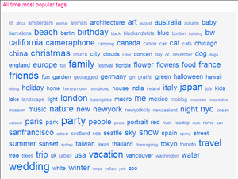
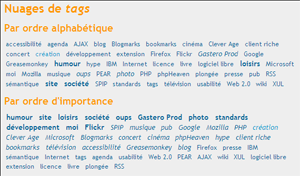

Vous avez déjà sans doute vu sur un site un «nuage d'étiquettes» — *[tag cloud](http://en.wikipedia.org/wiki/Tag_cloud)* en anglais — représentant la liste des sujets abordés, en mettant en avant les sujets les plus courants par un effet de grossissement.

Si ce n'est pas le cas, voici [un exemple de *tag cloud* sur Flickr](https://www.flickr.com/photos/tags/), qui représente les tags les plus utilisés depuis le lancement du service :

Sur Gastero Prod, j'ai mis en place ce mécanisme assez astucieux de listage des thèmes abordés, à la fois dans la colonne de navigation, et sur une page dédiée aux [tags](/tags/) :

Sur cette page, je peux lister les tags par ordre alphabétique, ce qui est l'usage classique, mais aussi par ordre d'importance, c'est à dire selon le nombre d'articles auxquels ils sont associés, ce qui est plus pratique sans doute pour les utilisateurs de synthèses vocales ou autres outils non graphiques de navigation.

C'est que je m'interroge justement sur la façon optimale de rendre accessible ces fameux *tag clouds*.

La plupart des solutions implémentées ne sont à mon avis pas satisfaisantes de ce point de vue, pour différentes raisons :

## Une liste, déjà, ce serait pas mal…

Certains n'utilisent tout simplement pas des éléments de type listes — `<ul>` ou `<ol>`[^1] — pour lister les tags, mais se contentent de mettre les tags les uns après les autres.

## La taille, c'est une information purement visuelle

Certains utilisent bien des listes, mais jouent sur l'importance relative des éléments en affectant directement une taille à chacun, via un attribut style en ligne, ce qui n'apporte aucune information sémantique — et donc plus accessible — d'importance relative.

## Près du but

Certains autres, enfin, apportent un début de sémantisation du contenu en montrant l'importance relative de chaque élément avec des balises `<em>` imbriqués, mais je ne pense pas qu'une imbrication de plusieurs balises identiques ait un réel intérêt pour l'accessibilité.

Est-ce qu'une synthèse vocale fera la différence entre les deux éléments suivants :

- `<em><em>tag1</em></em>`
- `<em><em><em>tag2</em></em></em>`

Je n'en suis pas sûr…

## L'unique solution ?

La meilleure solution que j'ai trouvée à ce jour, c'est d'exploiter le fait que la balise `<strong>` permet comme son nom l'indique de marquer une *strong emphasis*[^2], alors que la balise `<em>` a pour objectif de marquer une emphase simple.

Il m'est donc possible de différencier trois niveaux d'importance relative des éléments de ma liste :

- Minimum : `<li>tag</li>`
- Moyen : `<li><em>tag</em></li>`
- Maximum : `<li><strong>tag</strong></li>`

C'est sûr, c'est moins joli que les solutions qui utilisent beaucoup plus de variantes de tailles, mais au moins c'est censé être plus accessible.

## Une petite amélioration reste possible

Maintenant que le contenu est relativement accessible, rien n'empêche de rajouter de l'information en plus pour les heureux utilisateurs de navigateurs graphiques, en ajoutant par exemple des informations de taille aux éléments.

Cette information a bien un sens pour ceux qui peuvent l'exploiter, donc je ne pense pas que l'on puisse m'accuser de poluer le contenu avec de la présentation. Parfois, la présentation donne un sens.

## Restent tout de même quelques questions

- Est-ce que tout ça est vraiment accessible, ou est-ce que je me prends la tête pour rien ?
- Est-ce que, si la solution est bonne, elle peut être améliorée en ajoutant un niveau utilisant l'imbrication `<strong><em>tag</em></strong>`[^3] ?

Quoi qu'il en soit, voici une nouvelle preuve que la quête de l'accessibilité est loin d'être simple, et c'est toujours en tatonnant qu'on arrive à déterminer pragmatiquement les solutions les plus pertinentes.

[^1]: Lequel selon vous, est le plus pertinent ?

[^2]: Et non de mettre en gras, attention !

[^3]: Est-ce que cela sera bien interprété différemment des balises seules dans au moins un outil de navigation ?
