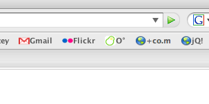

Dans sa version Mac OS, [Mozilla Firefox](http://www.mozilla-europe.org/fr/products/firefox/) est configuré pour ne pas afficher l'icône personnalisée d'un site à côté d'un favori placé dans la barre personnelle.


Ce choix est incompréhensible, l'apport ergonomique de ces *favicon*[^1] étant considérable pour identifier visuellement rapidement un favori.



Heureusement, une solution technique mais relativement simple existe. La technologie XUL employée par Mozilla fait qu'il suffit d'[éditer une feuille de styles CSS personnalisée pour changer la présentation de l'interface](http://www.geckozone.org/forum/viewtopic.php?t=28965). Car l'icône est en fait bien présente, elle est juste masquée.

Voici donc le bout de code à ajouter à votre feuille de style personnalisée `userChrome.css`[^2] qui se trouve dans `~/Library/Application Support/Firefox/Profiles/xxxxxxxx.default/chrome/` :

```css
.bookmark-item > .toolbarbutton-icon {
  margin: 0px !important;
  padding : 0px 2px 0px 0px !important;
  width: 18px !important;
  height: 16px !important;
  display: inline !important;
}

.bookmark-item:hover > .toolbarbutton-icon {
  background: url("chrome://browser/skin/bookmark-hover-mid.png") repeat-x !important;
}

.bookmark-item:hover:active > .toolbarbutton-icon {
  background: url("chrome://browser/skin/bookmark-open-mid.png") repeat-x !important;
}
```

J'ai testé avec succès cette technique tant sur [Firefox 2](http://www.mozilla.com/en-US/firefox/all.html) que sur la toute dernière [Firefox 3 beta 2](http://www.mozilla.com/en-US/firefox/all-beta.html).


[^1]: Leur nom technique, le fichier s'appelant par défaut `favicon.ico`

[^2]: A créer s'il n'existe pas déjà
