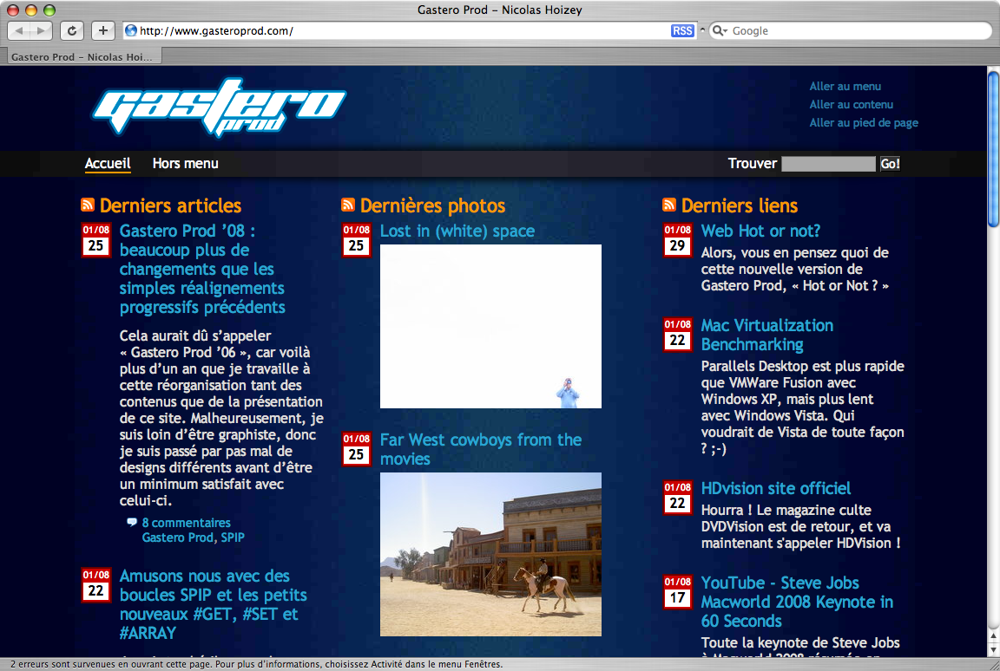

Utilisateur habituellement de Mozilla Firefox, j'ai lancé Safari pour tester GreaseKit[^1], et en allant sur Gastero Prod, j'ai découvert avec horreur que le fond dégradé est complètement dénaturé, avec un rendu beaucoup moins fin que sur Firefox.

[^1]: Un équivalent pour Safari de l'excellente extension [Greasemonkey](http://www.greasespot.net/)…

Voici par exemple le rendu sous Firefox :

Et celui sous Safari :

Plus en détail, voilà ce que ça donne :

{.onehalf}

{.onehalf}

## L'enquête

Après quelques recherches sur le Net, j'ai trouvé qu'il y a une disparité entre Safari et les autres navigateurs dans la gestion des couleurs. Safari essaie en effet d'utiliser le profil de couleurs ICC attaché à une image pour en déduire la correction nécessaire pour obtenir le bon rendu sur le terminal d'affichage. Toute cette [gestion avancée des profils colorimétriques](http://www.gballard.net/psd/go_live_page_profile/embeddedJPEGprofiles.html) pose du coup des soucis d'uniformité, seul Safari étant actuellement capable d'en profiter[^fx3]. Pour savoir si votre navigateur en est capable, visitez simplement cette [page de vérification du support des profils ICC](http://www.color.org/version4html.xalter).

[^fx3]: [Firefox 3 est annoncé comme supportant les profils de couleurs](http://www.news.com/2100-1012_3-6191815.html), mais la beta 2 n'est pas probante sur ce point.

## Des soupçons

Mais tout cela concerne uniquement la colorimétrie, et le rendu que j'obtiens sur Safari met plutôt en évidence des artefacts de compression de mauvaise qualité. Justement, la copie du dégradé dans Firefox présentée ci-dessus s'affiche bien dans Safari ! Cette copie d'écran est un fichier PNG, alors que l'image de fond d'origine est un JPEG.

Serait-ce donc plus un problème de support du format JPEG dans safari ?

## Le dénouement

J'allais publier cet article pour appeler à l'aide, et tenter de remplacer l'image par un PNG, au moins le temps de trouver la solution, mais j'ai finalement trouvé l'explication à tout ce bazar :

C'est le proxy Vodafone/SFR, par lequel on passe obligatoirement lorsqu'on se connecte avec une [clef 3G](http://www.sfrentreprises.fr/solutions/solutions-data/terminaux-sfr-global-access/cle-3g.jsp), qui recompresse les images à la volée pour réduire la bande passante consommée ! Ce qui est donc plutôt bien vu par le fournisseur d'accès — pour réduire la facture de ses clients, mais aussi surtout sa propre bande passante — m'a fait griller quelques neurones au passage.

Du coup je me rend compte que je n'ai tout simplement pas fait les copies d'écran Firefox et Safari au même moment, ni dans les mêmes conditions de connexion.

Tout est bien qui fini bien, nous aurons au moins appris des choses intéressantes sur la gestion colorimétrique des navigateurs… 😉
