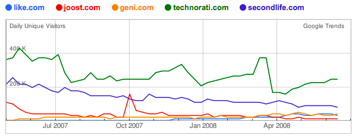
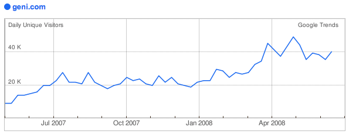
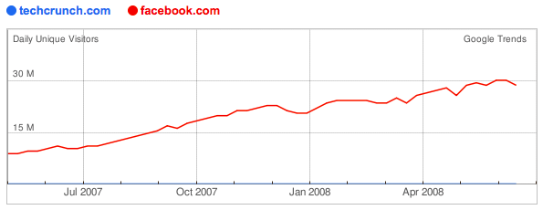

J'espère que cela va paraître surprenant à pas mal de monde, mais certains continuent apparemment de penser que le fort trafic d'un site Web — et on confond déjà quantité de visiteurs et quantité de pages vues[^1] — est une bonne mesure de sa qualité. L'éternel coup de celui qui a la plus grosse, en somme.

[^1]: Faut-il mieux avoir 1000 visiteurs qui consultent une seule page et repartent aussitôt faute d'avoir trouvé un quelconque intérêt au site visité, ou 10 visiteurs qui restent longuement et parcourent 100 pages ?

Par exemple, quand [Ouriel Ohayon enterre le service de généalogie Geni](http://fr.techcrunch.com/2008/07/05/fr-5-startups-qui-devaient-reussir/), c'est sous prétexte que son trafic n'a pas décollé. Et la démonstration — flagrante il faut dire — est faite sur un graphe réalisé avec [Google Trends](http://trends.google.com/websites), qui mélange allègrement des sites de nature très variée, et avec des écarts de trafic tels que celui de Geni est presque invisible :

Mais il ne faut pas être très malin pour voir que, même s'il est plus faible que celui des autres sites « analysés »[^2], le trafic de [Geni](http://www.geni.com/) est en hausse !

La preuve avec le [graphe Google Trends de Geni.com](http://trends.google.com/websites?q=geni.com&geo=all&date=all&sort=0), d'ailleurs, tant qu'à faire :

Deux fois plus de visiteurs qu'il y a un an, c'est pas mal non, pour un service qu'on ne va clairement pas visiter tous les jours, et sans doute de moins en moins au fur et à mesure de la stabilisation de l'arbre généalogique.

Personnellement, j'adore Geni, j'y ai créé un début de branche de mon arbre généalogique, en invitant tous les membres dont je connaissais l'adresse e-mail, et de proche en proche, avec les ajouts de chacun, il y a déjà près de 500 personnes dans « mon » arbre, dont le plus ancien membre est né en 1617[^3] !

Bon, pour revenir au sujet de ce billet, en imaginant qu'Ouriel ait raison et que le trafic d'un site soit représentatif de sa qualité, que dire de cette comparaison entre TechCrunch[^4] et Facebook :

Ah, tiens, TechCrunch n'a même pas assez de trafic pour que sa courbe apparaisse… 😉

[^2]: Un bien grand mot vu la profondeur de l'analyse

[^3]: Je confirme, celui-là n'a pas d'adresse e-mail…

[^4]: Google Trends ne gère pas pour l'instant les sous domaines
