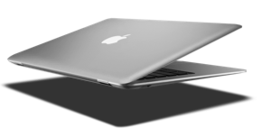

Alors que (presque) tous les constructeurs d'ordinateurs portables clonent l'imprévu [ASUS Eee PC](http://eeepc.asus.com/fr/index.htm) et se lancent à corps perdu dans la mêlée pour grappiller des parts de marché sur ce qu'on appelle désormais les « NetBooks », que fait Apple ? Une version 9 ou 10 pouces du [MacBook Air](http://www.apple.com/fr/macbookair/) — appelons-le MacBook Helium — trouverait sans doute de très nombreux acquéreurs !

D'un côté, certains en veulent encore à Apple d'avoir abandonné le format 12 pouces qui était disponible sur le [PowerBook G4](http://fr.wikipedia.org/wiki/PowerBook#Les_PowerBook_G4) en plus des formats 15 et 17 pouces toujours disponibles sur les [MacBook Pro](http://fr.wikipedia.org/wiki/MacBook_Pro).

{.onethird}

D'un autre côté, il y a certes un joli et léger [MacBook Air](http://fr.wikipedia.org/wiki/MacBook_Air) disponible depuis le début de l'année, et son prix a récemment bien chuté dans la version SSD, mais il reste d'une taille comparable à celle des [MacBook](http://fr.wikipedia.org/wiki/MacBook), écran de 13,3 pouces oblige, donc pas vraiment encore comparable à l'encombrement réduit des 9 ou 10 pouces[^1] des derniers NetBooks.

J'avoue que voir une nouvelle version 12 pouces ne ferait pas trop de sens, la différence avec les 13,3 pouces étant faible, mais il y a largement la place dans la gamme Apple — et dans les *wishlist* des fans et potentiels switcheurs — pour une version réduite et encore plus légère du MacBook Air, de 9 ou 10 pouces[^2].

Appelons le donc MacBook Helium, plus léger que l'Air… 😉

Il serait potentiellement un peu plus épais que le MacBook Air, la miniaturisation des composant ayant ses limites et l'espace disponible en largeur/profondeur devenant plus réduit, mais qu'importe. Il y aura le MacBook Air pour ceux qui veulent le perdre dans une pile de dossiers, et le MacBook Helium pour ceux qui veulent vraiment se balader avec dans la main un compromis optimal entre le MacBook Air et l'iPhone / iPod Touch.

Je laisse à d'autres le soin de définir plus précisément les spécifications d'un tel jouet, mais il me semble que reprendre celles du MacBook Air en revoyant les points qui fâchent — prix du SSD, étroitesse des boutons du trackpad, ajout d'un ou deux connecteurs USB et d'une prise RJ45, etc. — et en ajoutant un écran multi-touch[^3] devrait largement combler tout le monde !

En attendant, ceux qui font tourner [Mac OS X sur un ASUS Eee PC, un MSI Wind ou un Medion Akoya](http://www.journaldumac.com/2008/09/23/le-jdmac-nencourage-pas-le-hackintosh/) sont visiblement de plus en plus nombreux, et heureux…

[^1]: L'écran 7 pouces du premier Eee PC était une blague, le boitier ne profitant pas de cette taille réduite

[^2]: Au passage, je trouve que Sony est malin avec son nouveau [Vaio TT](http://www.journaldugeek.com/2008/09/23/le-sony-vaio-tt-devoile/) qui renouvelle sa lignée de 11 pouces, le cul entre deux chaises, entre le NetBook et le portable maintenant plus traditionnel de 13 pouces, mais sans grande concurrence.

[^3]: Ouais, OK, là je rêve…
