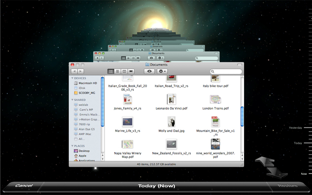

D'un côté, Apple rend les sauvegardes plus accessible au grand public avec [Time Machine (fr)](http://www.apple.com/fr/macosx/features/timemachine.html) fourni en standard dans Mac OS X 10.5 Leopard. D'un autre côté, les fabriquants de solutions NAS[^1] rivalisent d'ingéniosité pour conquérir ce même grand public. Au milieu, une incompatibilité de conception totale, merci Apple.

[^1]: *Network Area Storage*, soit Système de Stockage Réseau

# Le meilleur des mondes

Quand Apple a sorti Time Machine avec Leopard, tout le monde y a vu l'arrivée d'une solution de sauvegarde enfin vraiment simple et accessible au grand public. Tout se fait de manière transparente, avec conservation de versions successives, et surtout une interface d'accès aux sauvegardes vraiment intuitive pour le commun des mortels, et en plus plutôt ludique.

{caption="Recherche d'une sauvegarde dans Time Machine"}

En même temps, les NAS aussi sont devenus de plus en plus grand public, en facilitant la sauvegarde centralisée des ordinateurs qui pullulent de plus en plus même en usage domestique, et en devenant même de très complets serveurs multimédia grâce aux protocoles standards [UPnP (fr)](http://fr.wikipedia.org/wiki/Universal_Plug_and_Play) et [DLNA (fr)](http://fr.wikipedia.org/wiki/Digital_Living_Network_Alliance)[^1]. J'accède ainsi directement depuis ma PS3 aux contenus audio, vidéo et image qui sont sur mon portable sous Vista[^2] ou sur mon iMac[^3], et je pourrais faire de même avec des contenus stockés sur un NAS, la plupart intégrant aujourd'hui ce type de fonctionnalité.

# Oui mais…

Arrivé à ces constats, on se dit qu'il serait merveilleux de pouvoir utiliser ce stockage centralisé pour effectuer les sauvegardes de nos différents Mac avec Time Machine. Sauf qu'Apple a décidé -- ce n'était apparemment pas le cas dans les versions *beta* de Leopard -- d'interdire les sauvegardes sur des périphériques réseau autres que sa chère [Time Capsule (fr)](http://www.apple.com/fr/timecapsule/), très limitée en capacité et sans sécurité pour les données[^4].

# Ze dirty hack

Alors bien sûr, il existe [une solution simple pour utiliser quand même Time Machine avec un NAS (en)](http://www.macosxhints.com/article.php?story=20080420211034137), mais c'est un *[hack (en)](http://discussions.apple.com/message.jspa?messageID=8328327#8328327)* donc sans garantie que cela continuera à fonctionner dans le futur, et surtout cela suppose de faire les sauvegardes dans une image disque, ce qui pose de [gros problèmes de performance dès qu'un volume important est atteint (en)](http://8stars.org/a/2008/02/20/time-machine-to-nas-not-quite-there/).

# L'alternative

**Utiliser un autre logiciel de sauvegarde**

Une autre solution est donc de ne pas tenir compte de Time Machine[^5] et d'adopter un autre logiciel de sauvegarde permettant l'usage d'un NAS sans douleur. Et là le choix est difficile. Les fabriquants de NAS fournissent bien des logiciels de sauvegarde, mais la plupart sont dédiés à Windows, le Mac n'est pas encore suffisamment populaire pour eux[^6].

Il y a les grands classiques comme [SuperDuper (en)](http://www.shirt-pocket.com/SuperDuper/SuperDuperDescription.html), [CarbonCopyCloner (en)](http://www.bombich.com/software/ccc.html) ou [Synk (en)](http://decimus.net/), et tant d'autres, mais je m'avoue incapable de faire un choix juste en lisant leurs descriptions respectives. Et je ne suis pas sûr qu'un seul arrive à la cheville de Time Machine en terme d'ergonomie.

**Faire croire à Time Machine que le NAS est un disque USB**

Une autre solution serait peut-être d'utiliser quand même Time Machine, mais en lui faisant croire que le NAS est en fait un disque USB, par exemple avec le [hub USB sans fil de Belkin (en)](http://catalog.belkin.com/IWCatProductPage.process?Product_Id=377793)[^7] ou avec un [partage USB via réseau (en)](http://www.eltima.com/products/usb-over-ethernet/)[^8], le NAS étant connecté à un PC de base ne faisant que ça. Mais ça devient compliqué à mettre en œuvre matériellement, et existe-t-il de toute façon des NAS sachant aussi fonctionner en mode disque externe USB ?

# Que faire ?

Si vous vous êtes posé les mêmes questions, et avez trouvé une solution convenable, votre retour d'expérience m'intéresse, et intéressera sans doute énormément de monde !

[^1]: OK, ce n'est pas vraiment un protocole, plutôt un standard basé notamment sur UPnP

[^2]: Merci à Microsoft pour [Windows Media Player 11 (en)](http://www.microsoft.com/windows/windowsmedia/devices/athome/default.aspx)…

[^3]: Merci à Nullriver pour [MediaLink (en)](http://www.nullriver.com/products/medialink), et pas merci du tout à Apple pour l'absence de support natif dans Leopard et iLife…

[^4]: 500 Go ou 1 To, là où les NAS vont sans problème maintenant jusqu'à 4 To et plus en RAID 5

[^5]: Ou de le conserver uniquement pour retrouver facilement un fichier modifié ou effacé par erreur il y a peu de temps, avec un petit disque USB

[^6]: Chez [Synology (fr)](http://www.synology.com/fre/index.php), ils [recommandent (en)](http://www.synology.com/enu/support/help-page.php?q_id=352) d'utiliser le logiciel [SilverKeeper (en)](http://www.lacie.com/silverkeeper/) de LaCie, qui n'est pas compatible Leopard !

[^7]: Mais [ça n'a pas l'air de bien fonctionner (fr)](http://www.01net.com/fiche-produit/prise-main-5142/divers-belkin-wireless-usb-hub/), et ne semble de toute façon disponible que pour Windows…

[^8]: Sauf que ça ne fonctionne que sous Windows.
