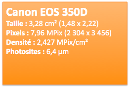
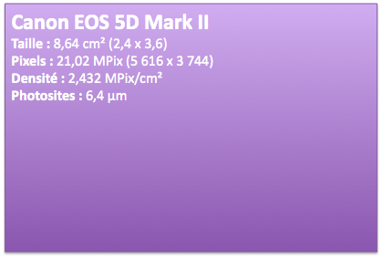
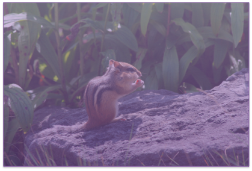
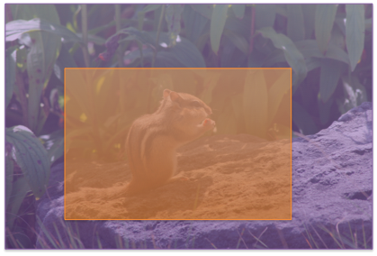

La sortie ces derniers mois de [plusieurs appareils photo numériques équipés de capteurs *full frame*](http://www.macandphoto.com/2008/10/le-grand-match.html)[^fullframe] à des prix devenus presque raisonnables, a séduit de nombreux photographes amateurs experts[^experts]. Les avantages du *full frame* sont nombreux, mais certains photographes — essentiellement animaliers et sportifs — préfèrent conserver leurs appareils à capteurs APS-C[^apsc], leur petite taille augmentant « magiquement » la longueur focale des téléobjectifs[^tele] et provoquant une zone de netteté plus grande, utile pour la macro. Sauf que mon Canon EOS 350D à capteur APS-C ne présente pas cet intérêt par rapport à mon nouveau Canon EOS 5D Mark II à capteur *full frame*. Je m'explique…

[^fullframe]: C'est à dire de même taille que les traditionnelles pellicules argentiques de 24x36mm de côté

[^experts]: Qui sont souvent déraisonnables, sans pouvoir se payer du matériel pro à 8000 €… 😉

[^apsc]: Appellation faisant référence aux pellicules argentiques au format APS, plus petit que le 24x36mm, correspondant aux capteurs les plus courants des reflex numériques.

[^tele]: En fait c'est l'angle de vision qui est réduit, d'où resserrement de l'espace photographié, et donc sensation de plus grande focale.

Les avantages des capteurs *full frame* sont donc multiples :

- retour aux « vraies » focales des objectifs, comme au bon vieux temps des reflex argentiques[^argentique]
- disponibilité de vrais objectifs grand angulaires
- à nombre de pixels équivalent, un capteur plus grand est constitué de cellules sensibles[^cellules] plus grandes et offrant donc une meilleure sensibilité et résistance à la diffraction

Mais dans l'absolu les capteurs APS-C ont aussi leurs avantages :

- transformation d'un télézoom 70-300mm en 112-480mm sur le Canon EOS 350D, de quoi faire des photos d'animaux sauvages ou de sportifs à l'autre bout d'un terrain
- la zone de netteté est étendue, ce qui permet en macro d'avoir en même temps nets tant la tête que l'abdomen d'une fourmi, par exemple
- le capteur étant plus petit, tant le boitier que les objectifs peuvent aussi l'être, ce qui permet de gagner en encombrement et poids global, et donc discrétion et mobilité

Pourquoi dis-je donc que mon 350D ne m'est plus utile, alors que j'aime faire de la photo naturaliste, tant en télé qu'en macro ?

Tout simplement parce que j'ai dans le capteur *full frame* du 5D Mark II presque exactement la même densité de pixels, et donc je peux obtenir par recadrage ce que j'aurais directement avec mon 350D.

La preuve en images. Voici les images proportionnelles des deux capteurs, avec indication de leurs caractéristiques techniques :

Histoire d'illustrer encore mieux mon propos, voilà une photo que je pourrais faire au 300mm avec le 5D Mark II :

Montrons le capteur *full frame* couvrant tout le cadre :

Avec le 350D, le 300mm deviendrais un 480mm et je pourrais ainsi avoir un cadrage plus serré comme tel :

Mais rien ne m'empêche de partir de la photo faite au 5D Mark II et de choisir par la suite un recadrage correspondant à ce même grossissement :

Au final, le résultat est le même, tant en cadrage qu'en nombre de pixels :

Alors certes, cela suppose de penser lors de la prise de vue au recadrage futur, mais cela évite tout de même de devoir se promener en permanence avec deux boitiers sous prétexte qu'ils ont chacun leur propres zones de confort[^deux].

Je tiens à préciser pour finir que cette illustration n'est pas valable pour toute comparaison entre un APS-C et un *full frame*, le nombre de pixels ayant une incidence forte sur les calculs réalisés.

[^argentique]: Sauf que ceux qui ont déjà fait autre chose que du 24x36 savent qu'il n'y a pas de « vraie » focale, la taille de la pellicule entrant évidemment en compte.

[^cellules]: Appelées aussi photosites.

[^deux]: Ce qui ne veut pas dire que je n'aurais pas parfois les deux sur moi, pour éviter de changer trop souvent d'objectif…
