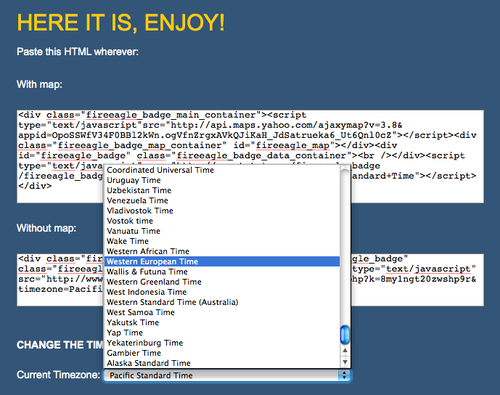

La géolocalisation est un service de plus en plus tendance, notamment au sein des applications Web sociales. La solution [Fire Eagle](http://fireeagle.yahoo.net/) de [Yahoo!](http://www.yahoo.com/) permet par exemple de centraliser la localisation d’une personne, et de rendre cette information disponible à toutes sortes de services. [Mike Bukhin](http://www.txtst.com/) a ainsi créé [Fire Eagle Badge](http://www.txtst.com/fireeagle_badge/) qui permet par exemple à un blogueur d’afficher une petite carte Yahoo! Maps sur son blog pour montrer en temps réel où il se trouve.

Voici par exemple ce que cela peut donner :

Malheureusement, [le formulaire permettant de créer le code JavaScript à insérer sur son blog](http://www.txtst.com/fireeagle_badge/auth_new.php?f=start) comporte une erreur ergonomique assez pénible au niveau du [tri de la liste](/2011/02/utiliser-un-tri-significatif-dans-les-listes.html) de choix du fuseau horaire :

Au début de la liste, il y a des noms de pays bien classés alphabétiquement, donc je me suis dit que j’allais trouver facilement la France, mais non. Il y a un choix « **F**rench Guiana Time » — qui apparaît après un « **G**eorgia Time » — mais aucun choix « France Time ». Après pas mal de prise de tête, j’ai fini par trouver un « Western European Time » qui doit être le meilleur choix pour la France.

Pour classer des fuseaux horaires, je vois deux possibilités :

- Utiliser la valeur de décalage horaire avec le méridien de Greenwich, comme dans [ce tableau des fuseaux horaires UTC](http://fr.wikipedia.org/wiki/Fuseau_horaire#D.C3.A9nominations_alphab.C3.A9tiques) -- l’UTC est le [Temps Universel Coordonné](http://fr.wikipedia.org/wiki/Temps_universel_coordonn%C3%A9) qui a remplacé le GMT[^1] -- et dans la plupart des formulaires de ce type que je connais;
- Utiliser le nom des pays, complétés des noms de régions et/ou villes quand un pays est couvert par plusieurs fuseaux.

[^1]: Un beau cas d’acronyme qui n’en est pas un, même le nom anglais ne donnant [pas UTC mais CUT](http://fr.wikipedia.org/wiki/Temps_universel_coordonn%C3%A9#Pourquoi_UTC_.3F)…
