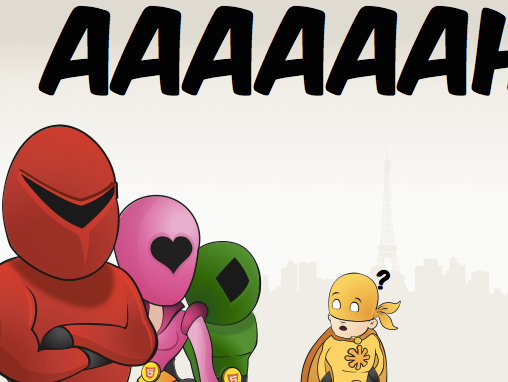

Pour faire des animations sur le Web, tout le monde sait que l'on peut utiliser CSS si l'animation est prédéfinie, ou JavaScript si elle dépend d'un contexte particulier (éventuellement en générant de la CSS). Si c'est du SVG que l'on veut animer, il est possible d'utiliser en plus SMIL.

J'avais déjà vu SMIL plusieurs fois avant, mais j'ai découvert sa puissance associé à SVG grâce à[^1] Jérémie Pattonnier avec son *Lightning Talk* « W3C Sentaï Team » à [Paris Web 2011](http://www.paris-web.fr/2011/conferences/lightning-talks.php).

Si vous ne l'avez pas encore vue, il s'agit d'une animation, en SVG complètement scriptée en SMIL, qui parle des Super Héros du Web, et elle est heureusement encore visible [sur son blog](http://jeremie.patonnier.net/post/2011/10/18/Paris-Web-2011-%3A-SVG-et-Typographie).

En moins de 5 minutes, Jérémie m'a motivé à développer en technologies Web standards un jeu que j'avais inventé en 1992, codé à l'époque en [Reverse Polish LISP](http://fr.wikipedia.org/wiki/RPL) sur calculette graphique HP 48.

Mais quand on parle de « jeu HTML5 », on sous-entend dans 99,99% des cas « jeu développé avec la balise Canvas de HTML5 ». Alors que j'ai décidé de profiter de l'élasticité totale du SVG pour être adapté nativement à toutes tailles d'écrans, et ce jeu a gagné un nom au passage, jeu de mot évident sur la technologie utilisée, « [esviji](http://esviji.com/) ».

Si vous [jouez à ce jeu](http://play.esviji.com/)[^2], vous verrez des animations de balles, translations, rotations, effets de transparence, etc. Toutes ces animations sont générées en JavaScript puisque dépendant de vos actions, mais les animations en elles-mêmes ne sont ni en CSS ni en JS, c'est bien du SMIL qui est généré.

La meilleure preuve, c'est le tutoriel qui est intégré au jeu, qui n'est qu'une grosse combinaison de nombreuses animations SMIL synchronisées de façon entièrement statique et déclarative.

J'ai extrait ce tutoriel du jeu et l'ai placé sur CodePen pour que vous vous rendiez bien compte :

See the Pen <a href='http://codepen.io/nhoizey/pen/ogLweQ/'>Animating SVG with SMIL (not any CSS or JS)</a> by Nicolas Hoizey (<a href='http://codepen.io/nhoizey'>@nhoizey</a>) on <a href='http://codepen.io'>CodePen</a>.

Je suis en train de travailler[^3] sur une grosse refonte du jeu pour une version 2, qui intègrera notamment du vrai responsive permettant de mieux exploiter des écrans en mode portrait ou paysage, voire même carré. Mais je vais surtout supprimer SMIL et passer à des animations scriptées en JS. SMIL n'est en effet pas destiner à perdurer, [les animations Web du futur](http://www.w3.org/TR/web-animations/) commençant à arriver, et Microsoft ayant clairement annoncé ne jamais supporter SMIL dans Internet Explorer.

Je me dirigerais sans doute vers la librairie [Snap.svg](http://snapsvg.io/) que l'on me vente beaucoup, mais je suis plutôt sur l'interface pour l'instant donc le choix n'est pas encore figé. Je veux aussi en profiter pour revoir complètement mon code JS qui fait peur à voir.

Il faudra donc sans doute attendre encore des mois avant de voir quoi que ce soit… 😉

[^1]: ou à cause de…

[^2]: Si vous êtes l'heureux possesseur d'un smartphone Firefox OS, vous pouvez même [l'installer depuis la Marketplace](https://marketplace.firefox.com/app/esviji/) !

[^3]: Depuis des mois, vivent les *pet projects* codés entre 2h et 3h du matin…
