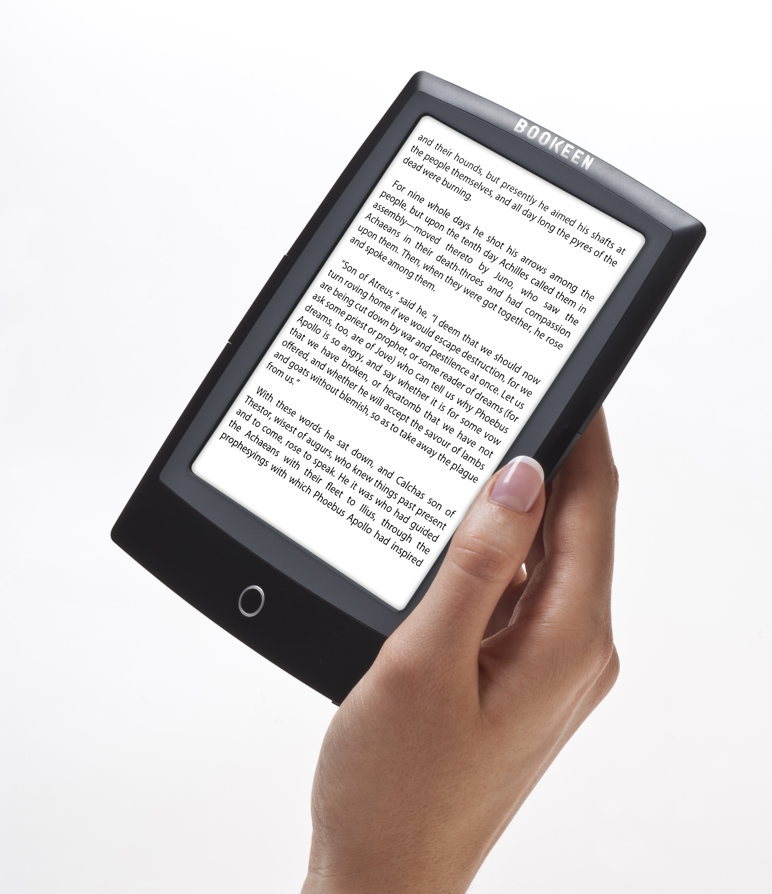

::: lead
Je réagi ici au [billet de Stéphane sur le livre numérique qu'il ne juge pas encore probant](http://nota-bene.org/Livre-numerique-pas-encore-probant-pour-moi) pour donner mon propre avis. J'allais répondre chez lui, mais j'ai voulu trop écrire, ça devenait inconfortable dans le petit champ de saisi, donc j'ai fini par plutôt écrire chez moi… 😉
:::

{.onethird}

Je lis extrêmement peu en dehors du Web (trop peu, même), et surtout des ouvrages consacrés à [mes deux passions](/a-propos.html) que sont le Web (surtout ses techniques) et la photographie (tant les techniques que les œuvres).

Je devrais lire plus de romans — je prends d'ailleurs plaisir à le faire de temps en temps, surtout en vacances —, mais je n'arrive pas à prendre le temps nécessaire, consacrant le peu que j'ai à mes lectures techniques associées à mes *pet projects* comme [mon jeu esviji](http://esviji.com/).

Mes deux thèmes de prédilection ne sont malheureusement pas compatibles avec les liseuses électroniques, à cause de :

- l'écran noir et blanc : un code source un peu long sans coloration syntaxique c'est vite pénible, et bien sûr, voir l'œuvre d'un Steve McCurry ou autre en noir et blanc n'est vraiment pas pertinent
- le petit écran : surtout pour les livres photos, dont j'ai quelques exemplaires vraiment grands
- la texture : là encore plutôt pour la photo, où le bon choix de papier peut transcender ou au contraire anéantir une belle photo
- les annotations : pour le coup, surtout pour les livres techniques, je n'ai pas trouvé mieux que les annotations directement dans le livre, avec post-it en marque page éventuellement

Par contre, pour les livres techniques, les versions électroniques sont très utiles pour retrouver rapidement un passage via une recherche en texte libre. Mais la recherche sur liseuse électronique — en tout cas sur ma vieille Bookeen — est galère.

J'achète du coup tous mes livres techniques en formats papier ET numérique, mais j'utilise plus le PDF sur mon ordi (pour la recherche) que l'ePub sur ma liseuse. Cela fait un sacré budget, mais j'ai ainsi la combinaison des deux conforts que je recherche.
