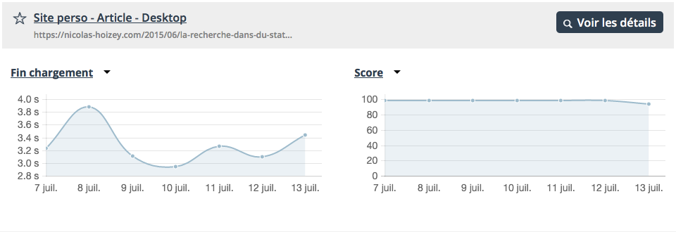

::: lead
Ce site est [généré avec Jekyll](https://nicolas-hoizey.com/about/the-website.html#avec-jekyll-le-statique-cest-fantastique) depuis plus d'un an maintenant, mais je n'avais pas encore réussi à migrer vers [Jekyll 3, sorti en octobre](https://jekyllrb.com/news/2015/10/26/jekyll-3-0-released/), à cause de multiples blocages liés à des plugins non compatibles. La migration est maintenant faite !
:::

# Tout change

## Jekyll 3

{.logo }

J'ai donc enfin pu migrer vers Jekyll 3, avec d'une part l'assurance de pouvoir suivre les évolutions du logiciel et de ses plugins, et d'autre part de pouvoir bénéficier de nouvelles fonctionnalités.

Mon bloquage principal pour cette migration était mon fork du plugin [Jekyll Picture Tag](https://github.com/nhoizey/jekyll-picture-tag/), qui me permettait :

- de mettre les images au même endroit que les billets en Markdown, fonction essentielle à mon avis pour faciliter la publication
- de générer le code HTML des images responsives à base de balises `<picture>`

Pour couvrir ces deux besoins, j'ai pris le parti de développer deux plugins séparés, maintenant disponibles pour la communauté :

## Un nouveau plugin pour associer les images aux posts Markdown

Le plugin [jekyll_post_files](https://nhoizey.github.io/jekyll_post_files/)[^rename] permet donc de mettre les images qui illustrent les billets (et même mes autres fichiers liés, PDF par exemple) avec ceux-ci dans `_posts/` ou un sous dossier, tout en laissant la possibilité de les mettre dans un dossier global `/assets/images/` si elle sont vouées à être partagées.

[^rename]: Il va peut-être falloir un jour changer son nom en `jekyll-postfiles` pour suivre [les pratiques des plugins Jekyll](http://ben.balter.com/jekyll-style-guide/plugins/#naming), même si elles sont différentes de [celles plus générales des Gems](http://guides.rubygems.org/name-your-gem/).

Cela permet d'avoir cette organisation de fichiers, par exemple :

```
_posts/
  2016-06-09-cloudflare/
    2016-06-09-so-long-cloudflare-and-thanks-for-all-the-fissh.md
    cloudflare-architecture.jpg
    performance-report-sample.pdf
assets/
  images/
    cloudflare-logo.png
```

Et d'utiliser directement l'image et le PDF dans le Markdown, sans aucun chemin :

```markdown


Lorem ipsum dolor sit amet, consectetur adipiscing elit, sed do eiusmod
tempor incididunt ut labore et dolore magna aliqua.


Ut enim ad minim veniam,
quis nostrud exercitation ullamco laboris nisi ut aliquip ex ea commodo
consequat.

Here is [an example of performance report](performance-report-sample.pdf).

Lorem ipsum dolor sit amet, consectetur adipiscing elit, sed do eiusmod
tempor incididunt ut labore et dolore magna aliqua.
```

Ceci implique qu'une prévisualisation live dans un éditeur comme [MacDown](http://macdown.uranusjr.com/) est complètement opérationnelle, sans aucune configuration spécifique.

Le support de la syntaxe courante basée sur un dossier global permet aussi d'installer le plugin sans rien casser, et de migrer progressivement les contenus qui le nécessitent.

## Un nouveau plugin pour gérer les images responsives avec Cloudinary

Le plugin Jekyll Picture Tag, même dans sa version d'origine, avait été mon choix à l'époque faute de mieux, [`<picture>` n'étant en général pas la bonne solution](https://cloudfour.com/thinks/dont-use-picture-most-of-the-time/){hreflang="en"}.

Il existe maintenant un plugin [Jekyll Responsive Image](https://github.com/wildlyinaccurate/jekyll-responsive-image) qui permet d'utiliser la syntaxe `srcset-w`/`sizes` en général plus appropriée, avec même son propre template.

{.logo }

Mais je voulais cesser de générer, optimiser et héberger moi-même les variantes d'images nécessaires, et plutôt m'appuyer sur [Cloudinary](http://cloudinary.com/invites/lpov9zyyucivvxsnalc5/sgyyc0j14k6p0sbt51nw), un des leaders des nombreux services SaaS de gestion d'images optimisés pour le responsive.

J'ai donc créé le nouveau plugin [Jekyll Cloudinary](https://nhoizey.github.io/jekyll-cloudinary/) qui ajoute un tag Liquid `` pour publier les images et générer automatiquement le code HTML avec `srcset-w`/`sizes` et des URL Cloudinary, voire même un ensemble `<figure>`/`<figcaption>` si une légende est précisée.

Je peux ainsi écrire ceci :



```markdown


```


Ce qui va générer, avec ma configuration :

```html
<figure>
  
  <figcaption>Un schéma montrant l'apport de Cloudflare</figcaption>
</figure>
```

Magique !

Mon temps de *build* du site a été largement réduit, même si les images générées étaient en cache, et le poids total du site chez mon hébergeur est passé de 325 Mo à 139 Mo.

Bien sûr, il faut ajouter le service [Cloudinary](http://cloudinary.com/invites/lpov9zyyucivvxsnalc5/sgyyc0j14k6p0sbt51nw) à l'équation, mais l'offre gratuite suffit amplement pour un blog comme le mien :


Mais cela ne me suffit pas, je travaille sur un plugin qui permettrait de profiter de ce même Cloudinary mais en n'utilisant que la syntaxe Markdown standard pour les images, pour retrouver cette facilité de publication — et prévisualisation en cours d'édition — que je vantais juste avant. Mais [ce n'est pas simple](https://github.com/jekyll/jekyll/issues/5099), je découvre en même temps Ruby, les subtilités des plugins Jekyll, etc.

## Le plugin Jekyll Algolia pour indexer les contenus

J'utilisais jusqu'à présent un `Rakefile` bidouillé à partir d'un autre trouvé sur GitHub pour indexer mes contenus en appelant l'API Algolia.

J'utilise maintenant [le plugin officiel](https://github.com/algolia/algoliasearch-jekyll), ce qui est bien plus pratique, et devrait permettre de meilleurs résultats.

# Rien ne change

Malgré ces nombreuses évolutions en coulisses, rien ne change pour les visiteurs, le site généré étant quasiment identique, et même strictement identique côté visuel !

# Mais si, un peu quand même, temporairement

Parmi les petits changements temporaires tout de même :

## Les vidéos ne sont plus *lazy loadées*

Les vidéos Youtube sont pour l'instant intégrées avec le *player* standard, donc ne sont plus *lazy loadées* au clic du lecteur. C'est une régression, mais elle n'est que temporaire, il faut que j'adapte le plugin [Jekyll Youtube Lazyloading](https://github.com/erossignon/jekyll-youtube-lazyloading) à mon nouveau [plugin d'embed automatique à partir d'une simple URL](https://github.com/nhoizey/nicolas-hoizey.com/blob/jekyll3/_plugins/auto-embed.rb).

Cela m'a fait perdre 4 points sur Dareboost, tout de même ! 😉



**MAJ :** Les vidéos sont de nouveau *lazy loadées*, comme vous pouvez le voir par exemple sur [ce billet à propos du moteur de recherche Algolia](/2015/06/la-recherche-dans-du-statique-facile-avec-algolia.html).

## La mise en évidence du terme recherché ne fonctionne plus

L'indexation Algolia via le plugin ne fonctionne pas comme celle que j'utilisais auparavant, ce qui signifie que les résultats n'ont plus la même structure.

Il faut encore que je corrige l'affichage des résultats dans la page de recherche, en m'inspirant peut-être de ce qu'à fait Algolia dans [son fork du thème Hyde](https://github.com/algolia/algoliasearch-jekyll-hyde).

# Tous les commentaires sont les bienvenus !

Je suis vraiment preneur de vos commentaires pour savoir comment encore améliorer ce site, ou ma mise en œuvre de Jekyll, merci d'avance.
