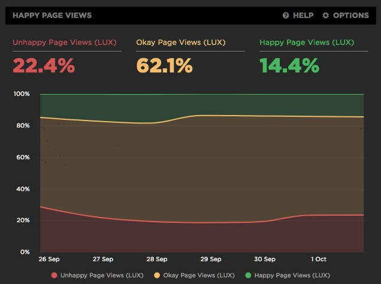

::: lead
I really like that [SpeedCurve](https://speedcurve.com/) tried to innovate with this recent "[User Happiness](https://support.speedcurve.com/docs/user-happiness)" metric ([original version](https://web.archive.org/web/20201124064307/https://support.speedcurve.com/en/articles/3380780-user-happiness)). It aggregates multiple technical metrics to decide if users visiting the page are happy or not with it. But I see several issues in this metric.
:::

{.zoom}

# How is SpeedCurve's User Happiness metric computed?

To be considered happy, a user navigation should validate all these technical metrics:

> - start render < 1100ms
> - AND page load < 3400ms
> - AND DOM Content Loaded < 1600ms
> - AND First Contentful Paint < 1200ms
> - AND First Input Delay < 8ms
> - AND First CPU Idle < 3900ms
> - AND longest Long Task < 380ms
> - AND total CPU Time < 1300ms
> - …

Even if performance is a key factor of happiness nowadays on the Web, the quality of the content and/or service provided by the page is obviously is even more important.

There are [a lot of publications on the Web about measuring user happiness](https://duckduckgo.com/?q=measure+User+Happiness&t=h_&ia=web), most of which consider multiple user experience factors.

I guess that's why SpeedCurve added two other metrics to the formula:

> - …
> - AND the user did not bounce
> - AND the user did not abandon the page before it finished loading

Interesting indeed.

But I see several issues in this:

# Users browse the Web in very different conditions

For the technical performance values, SpeedCurve chose "the thresholds [from] the median values across all of SpeedCurve's RUM data".

But as Bruce Lawson showed us a few years ago, we should be talking about the [World Wide Web, not Wealthy Westerners' Web](https://www.smashingmagazine.com/2017/03/world-wide-web-not-wealthy-western-web-part-1/) (read also [part 2](https://www.smashingmagazine.com/2017/03/world-wide-web-not-wealthy-western-web-part-2/)).

I think there are countries in the world where SpeedCurve's thresholds have no meaning at all, and users are very happy with much slower pages.

These threshold should at least be based on regional data, but that might not be enough, because even in the same region, expectations about speed can vary depending on the service, usage conditions, etc.

I don't believe it's possible to set such thresholds once and for all, people should be able to set their own thresholds.

# No bounce is not a good happiness indicator

I believe adding bounce and abandonment metrics to User Happiness comes from a good intention to consider happiness not only as pure speed oriented, but it has its own bias.

SpeedCurve tells us that

> bounced [is] the condition that contributes the most [to] the Unhappy page views
>
> In other words, no matter how well the other conditions perform, the number of Unhappy page views will always be 19% or higher.

But while bounce is often seen as an issue, it might be preferable sometimes.

When I'm looking for a precise information (store opening hours for example), I prefer coming directly from an external search to a page that contains the information, and bounce, than having to browse the site where the information is hard to find. In such scenarios, high bounce rate can be an indicator of good SEO, and user happiness. Even if the user abandon the page before it has finished loading, it might be because essential information was already available.

I don't think it's a good idea to consider bounces as failure to make the user happy.

So, as much as I'm happy people like SpeedCurve still try to find ways to monitor user happiness with automated technical tools, I think this iteration needs improvements. Keep up the good work!
