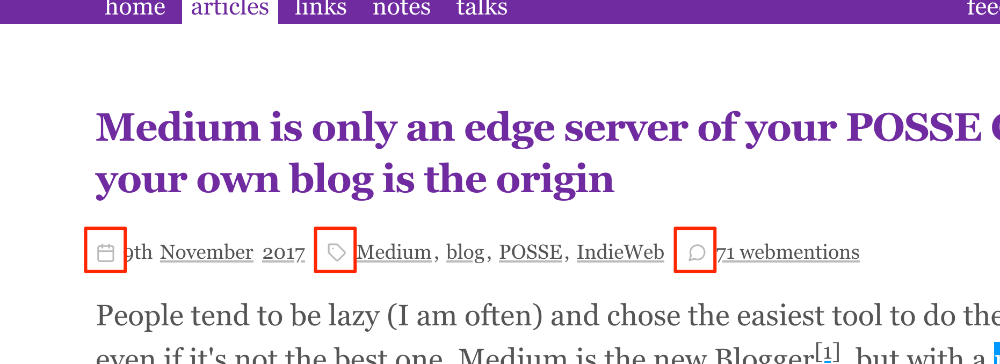

I'm using an SVG sprite on this site to make sure I don't repeat SVG code for icons that are used multiple times, and I inline it so the rendering doesn't depend on another resource loading. Here's how I build this sprite from individual SVG icons.

{.logo}
I'm using the very nice and open source [Feather icons](https://feathericons.com/). Feather provides [multiples ways to use the icons](https://github.com/feathericons/feather#usage), including a sprite, but it contains all icons and weights almost 60 KB (minified, not compressed), so it's really not a good option for me as I need only 9 of them. Feather also provides a way to load icons with JavaScript, obviously not the best choice either for performance in a statically generated site.

It's nice anyway that there's [`feather-icons` on npm](https://www.npmjs.com/package/feather-icons), as adding it to my dev dependencies is enough to make sure I'll will always have the latest versions.

Here's own these icons are used on this site:

{.border}

In pages listing multiple contents such as the home page, these icons are used multiple times, so it's best having each only once in the HTML, hence the use of a sprite. For the whole site, I use only 9 different icons, so the sprite is light, at only 3 KB(minified, not compressed).

To build this sprite, I use [`svgstore`](https://www.npmjs.com/package/svgstore) in the following Node.js script, where comments should be enough to understand how it works:

```javascript
const svgstore = require('svgstore');
const fs = require('fs');
const path = require('path');

// Where are Feather icons available from the npm package?
const ICONS_FOLDER = 'node_modules/feather-icons/dist/icons/';

// Which icons do I need for the sprite?
// icon filename + title for accessibility
const ICONS_LIST = {
  calendar: 'Date',
  info: 'Info',
  link: 'Link',
  wifi: 'Online',
  'wifi-off': 'Offline',
  search: 'Search',
  tag: 'Tag',
  twitter: 'Twitter',
  'message-circle': 'Webmention',
};

// Initiate the sprite with svgstore
let sprite = svgstore({
  // Add these attributes to the sprite SVG
  svgAttrs: { style: 'display: none;', 'aria-hidden': 'true' },
  // Copy these attributes from the icon source SVG to the symbol in the sprite
  copyAttrs: ['width', 'height'],
});

// Loop through each icon in the list
Object.entries(ICONS_LIST).forEach(([icon, title]) => {
  // Log the name of the icon and its title to the console
  console.log(`${icon}.svg -> ${title}`);
  const svgFile = fs
    // Load the content of the icon SVG file
    .readFileSync(path.join(ICONS_FOLDER, `${icon}.svg`), 'utf8')
    // Make its dimensions relative to the surounding text
    .replace(' width="24" height="24"', ' width="1em" height="1em"')
    // Remove useless attributes (for my usage) and add a title for accessibility
    .replace(
      / fill="none" stroke="currentColor" stroke-width="2" stroke-linecap="round" stroke-linejoin="round" class="feather feather-[^"]+">/,
      ` ><title id="${icon}-icon">${title}</title>`
    );
  // Add the new symbol to the sprite
  sprite.add(`symbol-${icon}`, svgFile, {
    // Add attributes for accessibility
    symbolAttrs: {
      'aria-labelledby': `${icon}-icon`,
      role: 'img',
    },
  });
});
// Finally, store the sprite in a file Eleventy will be able to include
fs.writeFileSync(
  'src/_includes/svg-sprite.svg',
  sprite.toString({ inline: true })
);
```

This script is located in [the `src/_utils/` folder](https://github.com/nhoizey/nicolas-hoizey.com/tree/master/src/_utils) of my Eleventy project, with other scripts I run with `npm`, like [my Webmention update script](/articles/2020/05/05/jamstack-is-fast-only-if-you-make-it-so/#server-side-first).

This script was previously part of my site build, but it made no sense, as the list of icons doesn't change much, and each icons are not often updated in the source. I just have to run `npm run svg` when I feel it useful, and my build is a little faster.
