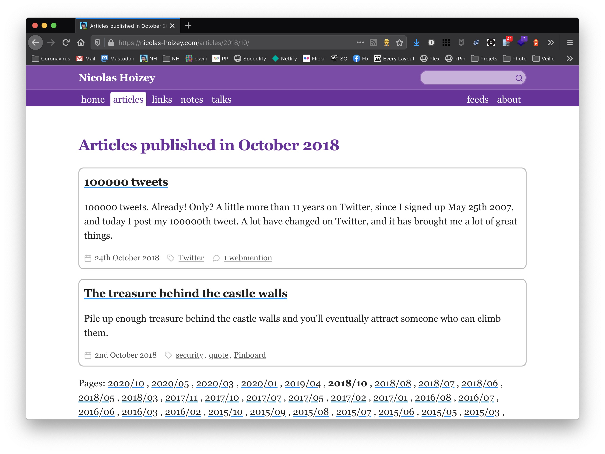
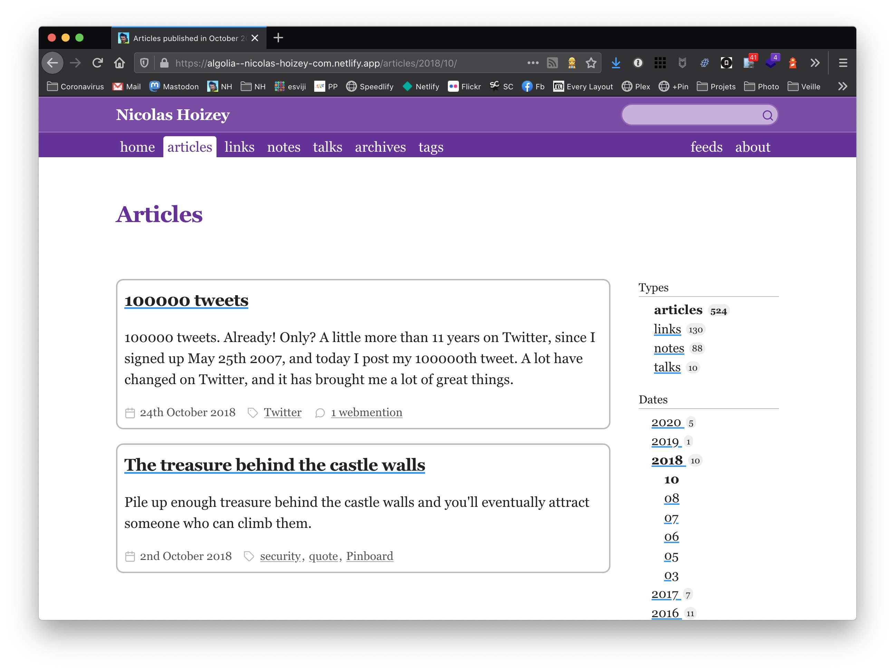

::: lead
I decided years ago to remove paged navigation (aka "pagination"), because I find it not user friendly at all, and a nightmare for SEO with new content pushing one tenth of contents to another page (for a 10 items per page pagination). Now, I improved the UX even further.
:::

Here's how the month by month navigation was presented earlier, in the page bottom:

While it was OK for the year by year navigation, such a full months list was really not user friendly, so I intended to enhance it a little.

Instead of "just" a little, I finaly chose to present this navigation with facets in a search engine, with the possibility to combine a filter for the content type, and another for the year or month of publication:

For example, you can navigate to the links I published in March 2019: [/links/2019/03/](/links/2019/03/).

I find it so easy to navigate, I wonder why I didn't have this idea earlier!

I already had the required [Eleventy collections](https://github.com/nhoizey/nicolas-hoizey.com/tree/master/src/_11ty/collections), so almost everything was done in a single shared Nunjucks template. Not the easiest one, I recon.

Now, I wonder if it's useful to keep the main navigation items for "[articles](/articles/)", "[links](/links/)", etc., or if the "[archives](/archives/)" navigation item is enough, which would obviously help on mobile.

As you might have guessed from this article's title, I'm working on further archives navigation enhancements, we'll see that soon online, and I'll explain in a dedicated article. Stay tuned!
