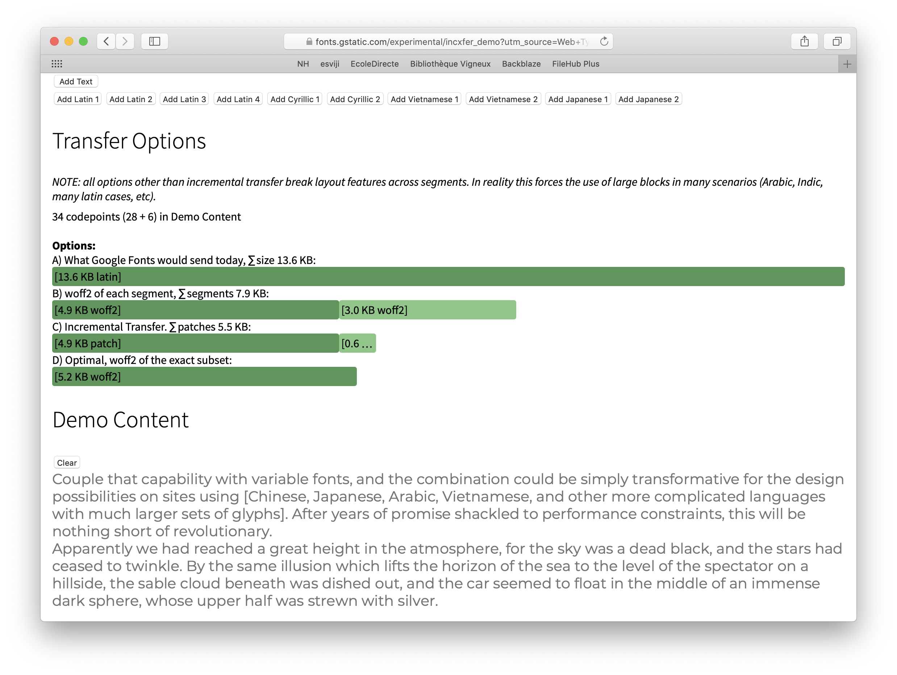

In issue #11 of his great Web Fonts & Typography News newsletter, Jason Pamental shares the progress made by the [W3C Web Fonts Working Group](https://www.w3.org/2009/08/WebFonts/charter.html) towards a new way to progressively serve fonts so that only the required new glyphs are downloaded every time new characters have to be rendered.

Think server side dynamic subsetting that remembers what it already sent to the browser.

They call it "Progressive Font Enrichment", and it looks awesome.

There's even [a live demo of progressive font enrichment](https://fonts.gstatic.com/experimental/incxfer_demo).

{caption="a live demo of progressive font enrichment"}

> Couple that capability with variable fonts, and the combination could be simply transformative for the design possibilities on sites using [Chinese, Japanese, Arabic, Vietnamese, and other more complicated languages with much larger sets of glyphs]. After years of promise shackled to performance constraints, this will be nothing short of revolutionary.
